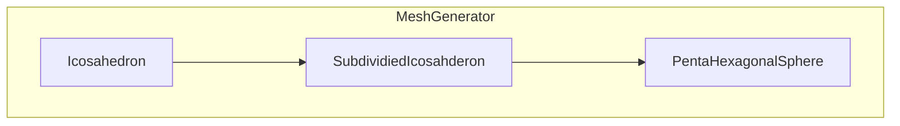

# TODO

둥근 구체를 만들고 그 위에 지형과 조형물을 배치하는 것을 목표로 합니다. 마치 지구를 관리하는 느낌을 주기 위해서요.

- [x] (2023 03 17)프로젝트를 설정합니다.
- [ ] 둥근 구체를 만드는 것을 목표로 합니다. 이를 위해서 자료조사를 합니다.
	1. 지오데식 구체(Geodesic sphere)
	2. penta hexagonal sphere
	* 플레이어가 상호작용 하기 위해서는 삼각형보다는 육각형의 느낌이 좋다고 생각이 되나 펜타 헥사고널 구체를 사용할 경우 연결점이 오각형인 문제는 고려해야 합니다.
- [ ] (2023 03 17)penta hexagonal sphere구현하도록 합니다.
	* 목표로 하는 결과물 https://www.youtube.com/watch?v=_m5UupkWO8I
	- [x] (2023 03 17)런타임에 메쉬를 만들고 렌더되도록 만듭니다.
	- [ ] (2023 03 17)Penta hexagonal sphere가 만들어지도록 합니다.
		- [x] (2023 03 19)용어정의 https://journals.ametsoc.org/view/journals/mwre/141/12/mwr-d-12-00236.1.xml 
		- [x] (2023 03 19) Default shape -> Ico sphere https://www.alexisgiard.com/icosahedron-sphere/ 
		- [ ] (2023 03 19)Ico sphere -> Penta hexagonal grid https://stackoverflow.com/questions/46777626/mathematically-producing-sphere-shaped-hexagonal-grid 
		- [ ] (2023 03 19)그리드에 좌표(coordinate) 적용하기 Triangle이 폴 값을 가지도록 
		- [ ] (2023 03 19)레이케스트로 교차되는 좌표 구하기 
- [ ] 다음 목표 점검
	- [ ] UV 매핑
	- [ ] 지형 시뮬레이션
	- [ ] 플루이드 시뮬레이션
